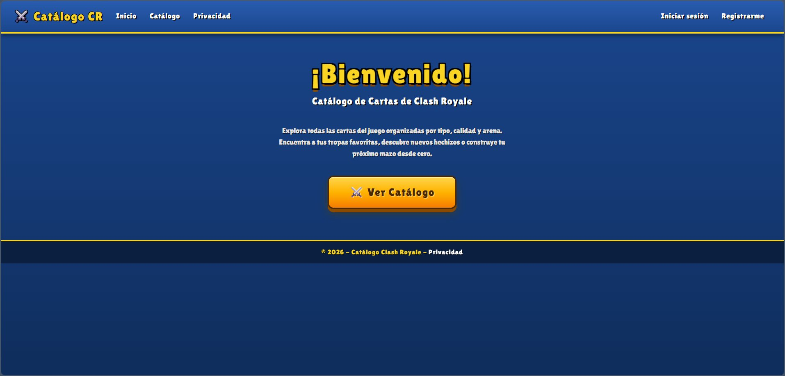
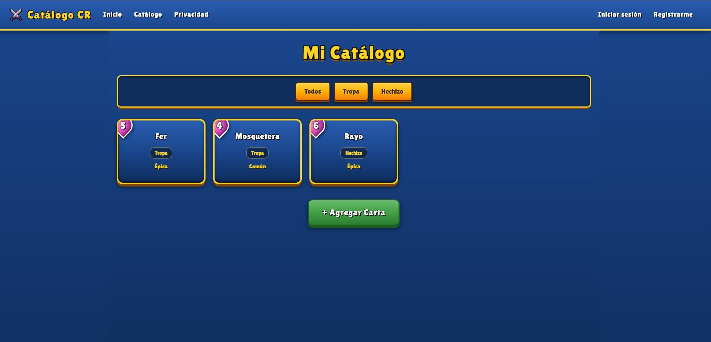
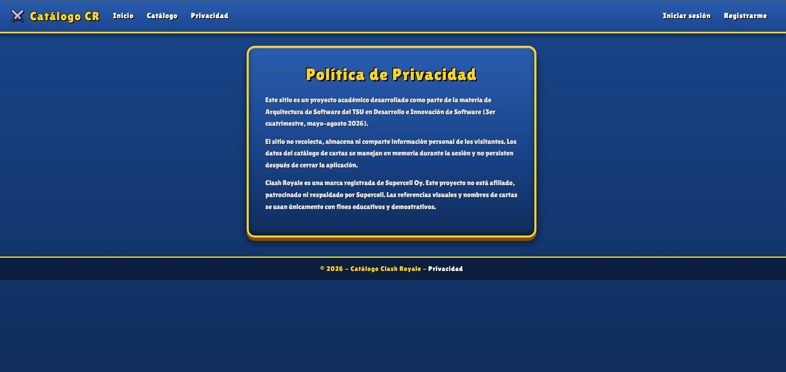
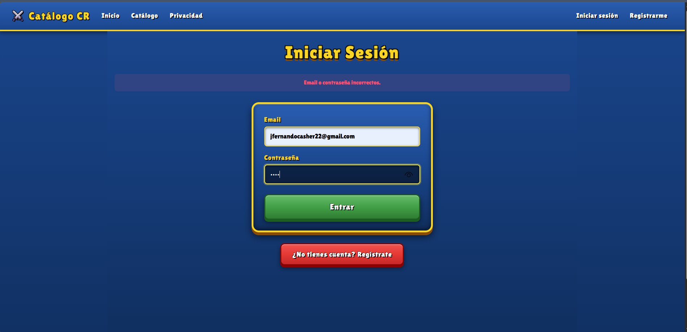
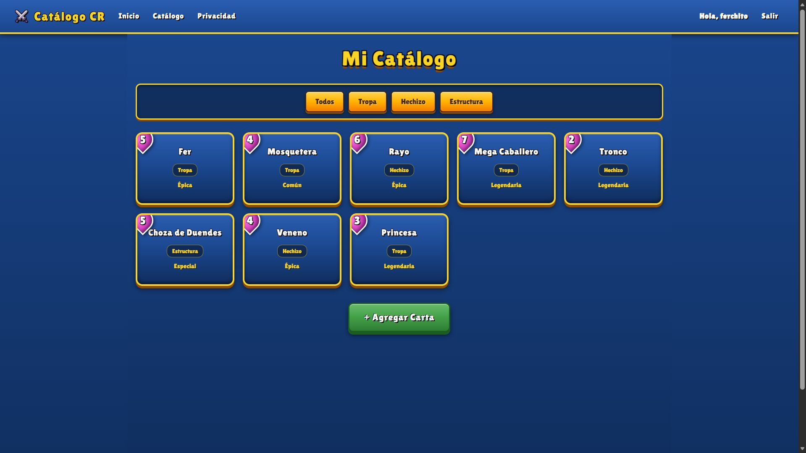
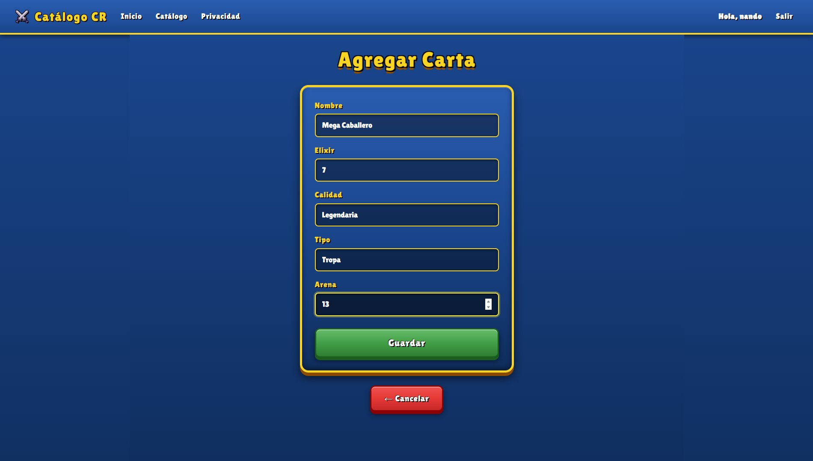
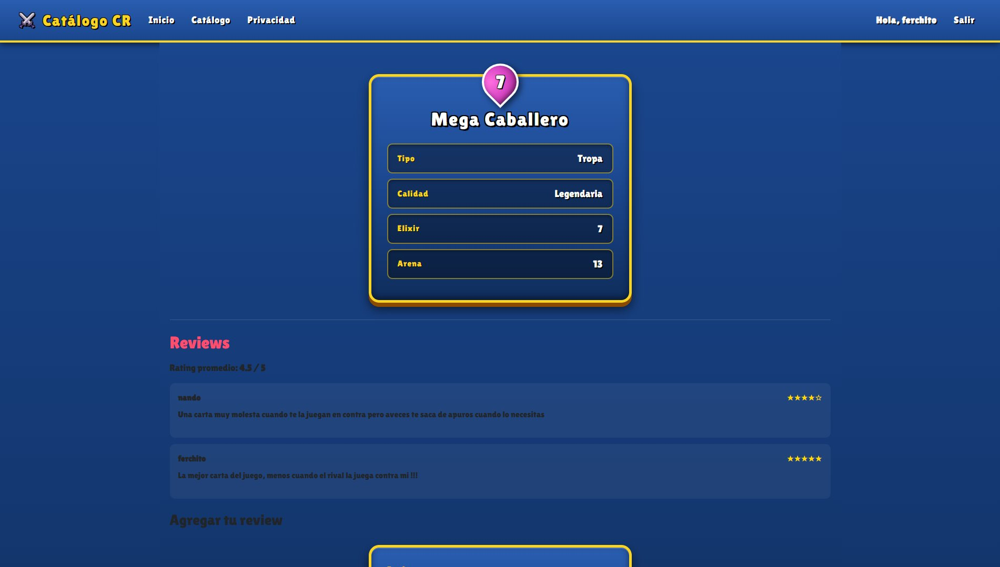

# CatalogoApp — Catálogo de Cartas de Clash Royale

Aplicación web construida con **ASP.NET Core MVC** sobre **.NET 10**, que permite explorar un catálogo de cartas de Clash Royale, registrarse como usuario e iniciar sesión para escribir y leer reseñas (reviews) sobre cada carta.

Proyecto académico desarrollado para la materia de **Arquitectura de Software** del TSU en Desarrollo de Software (3er cuatrimestre, mayo–agosto 2026).

---

## Vistas del sitio

A continuación se muestra el recorrido por la aplicación.

**Página de inicio.** Pantalla de bienvenida con acceso directo al catálogo.

**Catálogo sin sesión.** Cualquier visitante puede ver las cartas, filtrarlas por tipo y entrar al detalle, pero aún no puede ver las reseñas.

**Página de privacidad.** Aviso del proyecto y nota sobre la marca Clash Royale.

**Inicio de sesión.** Formulario de login. Si las credenciales son incorrectas se muestra un mensaje genérico por seguridad.

**Catálogo con sesión iniciada.** Una vez logueado, el menú saluda al usuario y aparece el botón de salir. Se ven todas las cartas y los filtros por tipo.

**Agregar carta.** Formulario para registrar una nueva carta en el catálogo.

**Detalle de carta con reseñas.** Al entrar con sesión activa se muestran las estadísticas de la carta, el rating promedio y las reseñas de los usuarios, además del formulario para publicar una nueva.

---

## Cómo funciona la página (resumen)

Al abrir el sitio, el visitante llega a una página de inicio desde la que accede al **catálogo**, donde puede ver las cartas y filtrarlas por tipo (Tropa, Hechizo, Estructura). Para **ver o escribir reseñas** debe primero **registrarse** e **iniciar sesión**: mientras no haya sesión activa, la sección de comentarios permanece oculta. Una vez dentro, el usuario puede entrar al detalle de cualquier carta, leer las reseñas de otros, consultar el rating promedio y dejar su propia reseña con una calificación de 1 a 5 estrellas. Toda la información (cartas, usuarios y reseñas) se guarda en archivos JSON, y la sesión recuerda quién está conectado hasta que cierra sesión.

---

## Arquitectura

El proyecto está organizado en **cuatro capas**, cada una en su propio proyecto, siguiendo los principios de arquitectura limpia. Las dependencias siempre apuntan hacia el dominio, nunca al revés.

| Capa | Proyecto | Responsabilidad |
|------|----------|-----------------|
| **Dominio** | `Catalogo.Domain` | Entidades (`Item`, `User`, `Review`) e interfaces de repositorio. Es el núcleo y no depende de nadie. |
| **Aplicación** | `Catalogo.Application` | Lógica de negocio en servicios (`ItemService`, `AuthService`, `ReviewService`). Valida y orquesta. Depende solo del dominio. |
| **Infraestructura** | `Catalogo.Infraestructure` | Implementación de los repositorios con persistencia en archivos JSON. Depende solo del dominio. |
| **Presentación** | `Catalogo.Presentation` | Aplicación web MVC: controladores, vistas Razor y configuración. Es el punto de entrada. |

El flujo de dependencias es: **Presentación → Aplicación → Dominio**, e **Infraestructura → Dominio**. La interfaz de cada repositorio vive en el dominio y su implementación en infraestructura, de modo que la capa de aplicación no sabe si los datos vienen de JSON, una base de datos o memoria.

---

## Cómo funciona (detalle técnico)

La aplicación usa **inyección de dependencias**: en `Program.cs` se registran los repositorios y servicios, y ASP.NET los entrega automáticamente a los controladores que los necesitan.

La **persistencia** se hace en tres archivos JSON dentro de la carpeta `Data/`:

- `items.json` — las cartas del catálogo.
- `users.json` — los usuarios registrados (las contraseñas se guardan **hasheadas con BCrypt**, nunca en texto plano).
- `reviews.json` — las reseñas, cada una ligada a una carta (`ItemId`) y a su autor (`UserId`).

La **sesión** (`HttpContext.Session`) recuerda qué usuario inició sesión. Al hacer login se guarda el id y el nombre del usuario en la sesión; esa información se usa para mostrar el saludo en el menú, para firmar las reseñas con el nombre real del autor y para controlar el acceso a los comentarios.

---

## Características

- Catálogo de cartas con filtro por tipo (Tropa, Hechizo, Estructura, etc.).
- Vista de detalle de cada carta con todas sus estadísticas.
- Alta de nuevas cartas mediante formulario.
- Registro e inicio de sesión de usuarios con contraseñas cifradas (BCrypt).
- Sistema de reseñas por carta, con comentario y calificación de 1 a 5 estrellas.
- Cálculo del rating promedio de cada carta.
- Control de acceso: las reseñas solo son visibles y editables para usuarios con sesión iniciada.
- Validaciones de negocio en la capa de aplicación (campos obligatorios, rangos de calificación, emails únicos).

---

## Acciones que puede hacer un usuario

**Sin iniciar sesión:**

- Ver el catálogo completo de cartas.
- Filtrar las cartas por tipo.
- Ver el detalle y las estadísticas de cualquier carta.
- Agregar nuevas cartas al catálogo.
- Registrarse para crear una cuenta.
- Iniciar sesión.

**Con sesión iniciada (además de lo anterior):**

- Ver las reseñas de cada carta.
- Ver el rating promedio de cada carta.
- Escribir una reseña con comentario y calificación.
- Cerrar sesión.

> Si un usuario sin sesión entra al detalle de una carta, en lugar de las reseñas verá un aviso invitándolo a iniciar sesión. Los comentarios no se envían siquiera al navegador hasta que haya una sesión activa.

---

## Tecnologías

- ASP.NET Core MVC (.NET 10)
- C#
- BCrypt.Net-Next (hashing de contraseñas)
- Bootstrap como base del layout, con un CSS personalizado que da la identidad visual estilo Clash Royale
- Persistencia en archivos JSON (`System.Text.Json`)

---

## Cómo ejecutar

1. Clonar el repositorio.
2. Abrir `CatalogoApp.slnx` en Visual Studio 2022/2026.
3. Establecer `Catalogo.Presentation` como proyecto de inicio.
4. Ejecutar (F5). La aplicación abrirá en el navegador.

---

## Uso de Inteligencia Artificial

Durante el desarrollo de este sitio web se utilizó una herramienta de inteligencia artificial (IA) como apoyo para la generación de código, la resolución de errores y la elaboración de la documentación.
